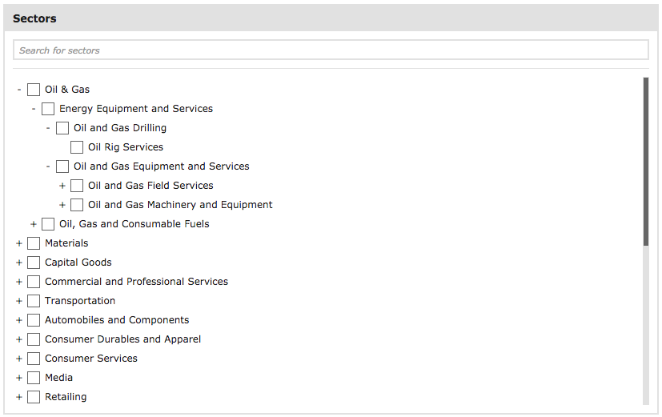

# Front End Test - Intermediate

We would like you to create a tool which visually presents data in a [tree-view](https://en.wikipedia.org/wiki/Tree_view) format. The user interface should display the list of initial categories and when selected should expand to show the sub-list within.

For example, given the following:

```json
[{
  "id": "1",
  "name": "Oil & Gas",
  "items": [
    {
      "id":"2",
      "name": "Energy Equipment and Services"
    }
  ]
}]
```

It should first display ```Oil & Gas```. When this is selected it should reveal ```Energy Equipment and Services```.

In addition, this list should also be searchable. So, if the word ```energy``` is searched it should display ```Energy Equipment and Services``` and all parent nodes.



## Back End

We want to be able to persist selected sectors in a database so next time after refreshing the page the data is loaded and reflected on the tree. Application should save the tree whenever sector or group of sectors get selected. 

## Requirements

* Create a tool which renders a tree-view component from a dataset (see screenshot above)
* Use the dataset provided here: [sectors.json](sectors.json)
* Allow users to search this dataset for a word which filters the list based on the search term
* For front end use React, but no other libraries (no Redux or open source TreeView components etc) to create this tool. Create React App or similar is fine.
* For back end feel free to use any node.js framework and a database of your choice (sql or no-sql) 
* Use ES2015+ syntax
* Send us your code to review via GitHub

## What we are looking for

We are looking for how you approach the following:

* Creating an algorithm for rendering and searching
* Handling state management in React
* Creating extendable/reusable components
* Api and application design

## Bonus points

* Basic styling - This doesn't need to be pretty, but you are free to use your choice of css (native/Less/Sass etc)
* Testability

